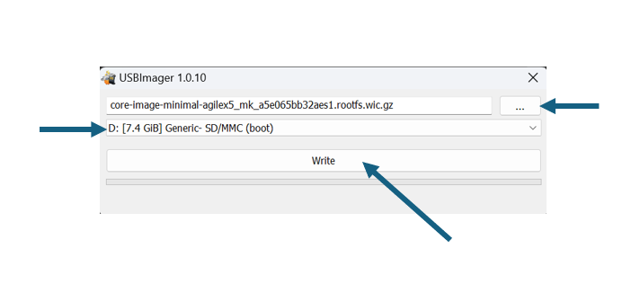

# SD Card Image Flashing

The following instructions detail how to write a `wic` image to an SD Card. The `wic` image may be raw or compressed such as `wic.gz` or `wic.bz2`.

By default you will get a `wic.gz` and a `wic.bmap` file after a successful build using the layers in this repository. These files can be found in `build/tmp/deploy/images/${MACHINE}` if building from source.

## [`bmaptool`](https://github.com/yoctoproject/bmaptool) (Linux)

On many distributions `bmap-tools` can be installed using your distros package manager (e.g. `sudo apt install bmap-tools`).

For more information see the [Yocto documentation](https://docs.yoctoproject.org/dev-manual/bmaptool.html) for `bmaptool`.

You will require either a `.wic`, `.wic.gz` or `.wic.bz2` image file along with a `.wic.bmap` file in order to use `bmaptool`.

First of all determine the device `logical name` associated with the SD card on your host:

```
sudo lshw -class disk
```

Use `bmaptool` to copy the image to the SD card. Make sure the `wic` image file and `bmap` file are in the same directory.

```
sudo bmaptool copy ${IMAGE} ${DEVICE}
```

For example:

```
sudo bmaptool copy build/tmp/deploy/images/agilex5_mk_a5e065bb32aes1/core-image-minimal-agilex5_mk_a5e065bb32aes1.rootfs.wic.gz /dev/sda
```

## [USBImager](https://bztsrc.gitlab.io/usbimager/) (Windows, Linux, Mac OS)

You will require either a `.wic`, `.wic.gz` or `.wic.bz2` image file before proceeding.

* Open [USBImager](https://bztsrc.gitlab.io/usbimager/) and click the `...` button in the top right.
* Select the image you would like to copy to the SD card and click `Open`.
* Next select the device associated with your SD card from the drop-down list.
* Click `Write` to start flashing.


<center>



</center>
